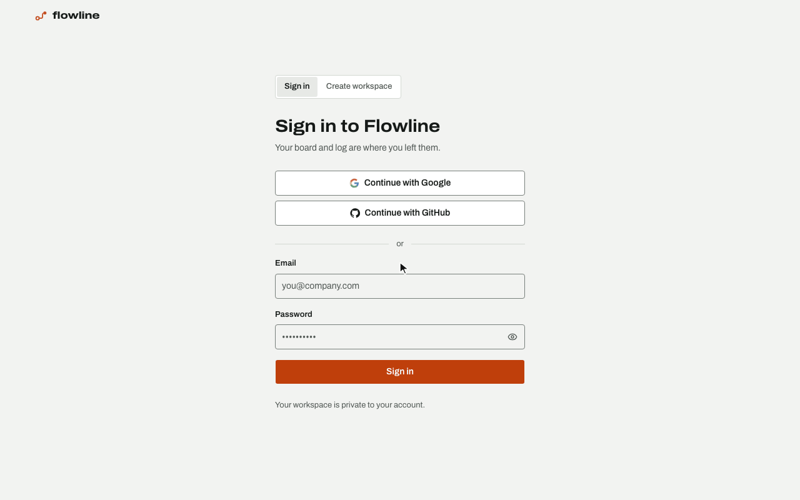

# flowline

A board that follows the flow line your team actually uses, and a written daily
log it fills in for you. For teams that hate status meetings.

Built entirely in [Jac](https://www.jaseci.org/) (graph-native backend plus a
JSX/React client) with [jac-shadcn](https://github.com/jaseci-labs/jaseci) UI.



## Design your flow line, get your board

Most tools hand every team the same columns. Here you draw the steps your team
really uses, connect them however work moves (loops and branches included), and
the board becomes those steps, in the order you drew them, each in its own
colour.

Start from the Jaseci flow template (specify, triage, architect, build, review,
de-slop: four roles, with the loops between them) or from a blank canvas. Drag
a step to move it, drag from its border onto another step to draw a transition,
click a transition to remove it. The canvas zooms rather than scrolls, so the
whole graph stays on screen.

Every step carries a *kind* behind the name you chose: start, active, handoff,
blocked or done. The name is yours, the kind is what the app understands, which
is why renaming a step never changes how anything behaves.

## What it does

- **A flow line per organization** and a board built from it: your steps, your
  order, your colours, all on one row however many there are
- **The board writes the log**: creating a task and every move land in the
  activity feed automatically, with timestamps, issue/PR links and who was involved
- **Handoffs ask for detail**: moving work to a handoff or blocked step asks
  (optionally) for a reviewer, a review-by date, a PR link or what is blocking it
- **Multi-assignee tasks**, free-text categories and tags, repos attached to projects
- **GitHub, live**: install the app on the repos you choose; issues opened,
  closed or reopened and pull requests merged on GitHub land on an open board
  within seconds, import issues as tasks, watch pull-request state on the
  cards, and open an issue from a task
- **An Overview tab** with headline numbers, per-project progress and per-person activity
- **An assistant** that reads the whole workspace and writes the standup note for
  you, answers questions about your own board, and turns "add a task for Nadia on
  the docs site" into a suggestion you confirm before anything is written
- **Light and dark**, chosen on the Settings tab or followed from your device

## Install Jac

Jac ships as a single native binary. No Python, pip or Node required up front:

```bash
curl -fsSL https://raw.githubusercontent.com/jaseci-labs/jaseci/main/scripts/install.sh | bash
```

Run `jac` afterwards to confirm it is on your PATH.

## Run the app

```bash
jac install                 # dependencies (Python + npm) from jac.toml
jac run --no-dev main.jac   # serve at http://localhost:8000
```

Use `jac run main.jac` for hot reload while developing (app on :8000, API on :8001).

Copy `.env.example` to `.env` and fill in what you need. Everything in it is
optional: without `OPENAI_API_KEY` the app runs fine and only the assistant is
unavailable, and leaving a Google or GitHub pair empty simply hides that
sign-in button.

## Connecting GitHub

The GitHub tab needs its own **GitHub App**, which is separate from the GitHub
sign-in button. Signing in with GitHub only proves who someone is: the runtime
discards that OAuth token, so reading issues and pull requests needs a
credential of its own.

Create one at <https://github.com/settings/apps/new>:

| Field | Value |
| --- | --- |
| Callback URL | `<HOST>/workspace?tab=github` |
| Setup URL | `<HOST>/workspace?tab=github`, with "Redirect on update" ticked |
| Request user authorization (OAuth) during installation | **on** |
| Webhook | **Active**, URL `<HOST>/webhook/GithubEvent`, a secret you generate (`openssl rand -hex 32`) |
| Subscribe to events | Issues · Pull request · Pull request review · Sub-issues (installation events are sent to every App on their own) |
| Repository permissions | Issues: read and write · Pull requests: read · Metadata: read |

The OAuth-during-installation box is not optional. Installation ids are small
integers, so completing a connection requires proving the person who
authorized can actually see that installation; with the box off, that check
cannot run and connecting is refused.

Generate a private key, then set `GITHUB_APP_ID`, `GITHUB_APP_SLUG`,
`GITHUB_APP_CLIENT_ID`, `GITHUB_APP_CLIENT_SECRET`, `GITHUB_APP_PRIVATE_KEY`
(see `.env.example` for the base64 one-liner) and `GITHUB_APP_WEBHOOK_SECRET`,
the same secret you gave the webhook. Leave the first five empty and the
GitHub tab explains what is missing instead of failing; leave the webhook
secret empty and the server refuses to start, since the receiver would have
nothing to verify deliveries against.

What the app stores is an installation id, not a token: each request mints a
one-hour installation token in memory and drops it.

### What syncs live

GitHub posts each change to `/webhook/GithubEvent`. The runtime checks the
signature before any app code runs, and the receiver only queues the delivery:
it never calls GitHub and never touches a workspace. An open board applies its
own queue every 20 seconds, so a card appears or moves without a reload, and
the GitHub tab shows "Live · last event N ago". What lands this way, for the
repos you track:

- an issue opened, edited, closed, reopened, deleted or transferred (a closed
  issue moves its card to your done step when the repo's auto-done is on)
- a pull request's state on the card, and a merge moving the card to done
  under the same auto-done setting
- who GitHub has assigned an issue to, and a review requested on a linked
  pull request or answered with an approval or a change request
- sub-issue links added or removed
- the App suspended, unsuspended or uninstalled, and repos removed from it

The log entry carries the event's own time, not the time someone next opened
the board.

### What the reconcile pass still does

Opening the board still runs the GitHub poll, on a cooldown: every 15 minutes
while deliveries are flowing, every minute otherwise. It catches history from
before the webhook existed and anything delivered while the app was being
deployed. GitHub does not retry a failed delivery on its own; the App's
Advanced tab lists every delivery with its response and a Redeliver button.

Flowline writes to GitHub in two cases: an issue you explicitly create from a
task, and, per repo and off by default ("Close issue on done"), closing the
issue when its card reaches your done step. The receiver drops the App's own
echo of that close, so the card is not moved or logged twice. Nothing runs on
a schedule: a workspace nobody opens stays as it was.

## License

[MIT](LICENSE)
