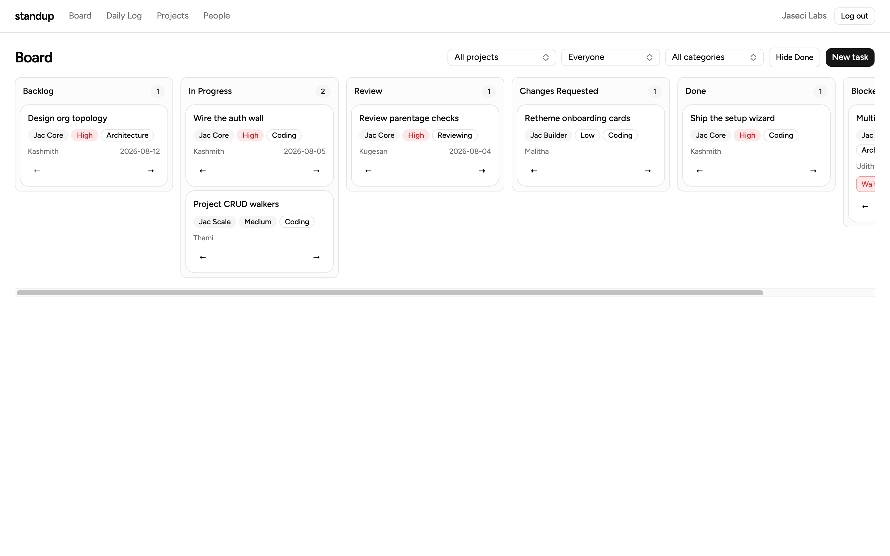
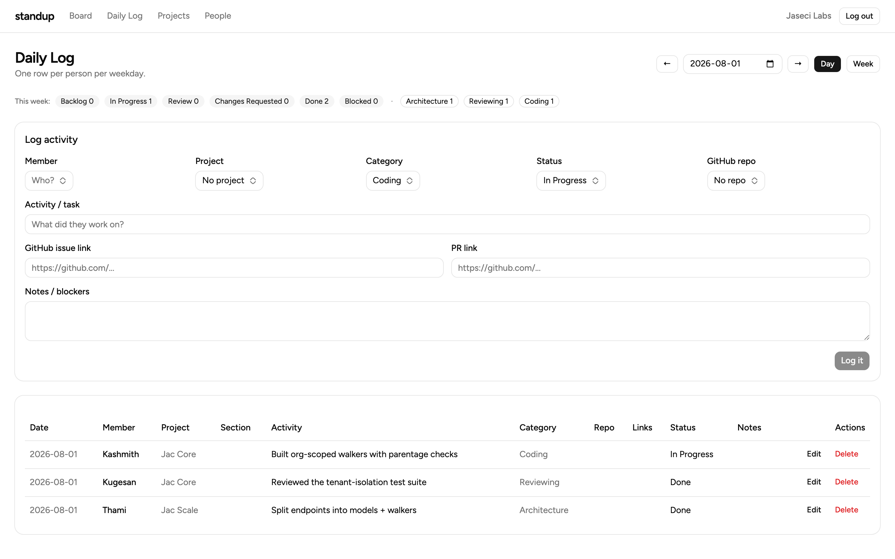
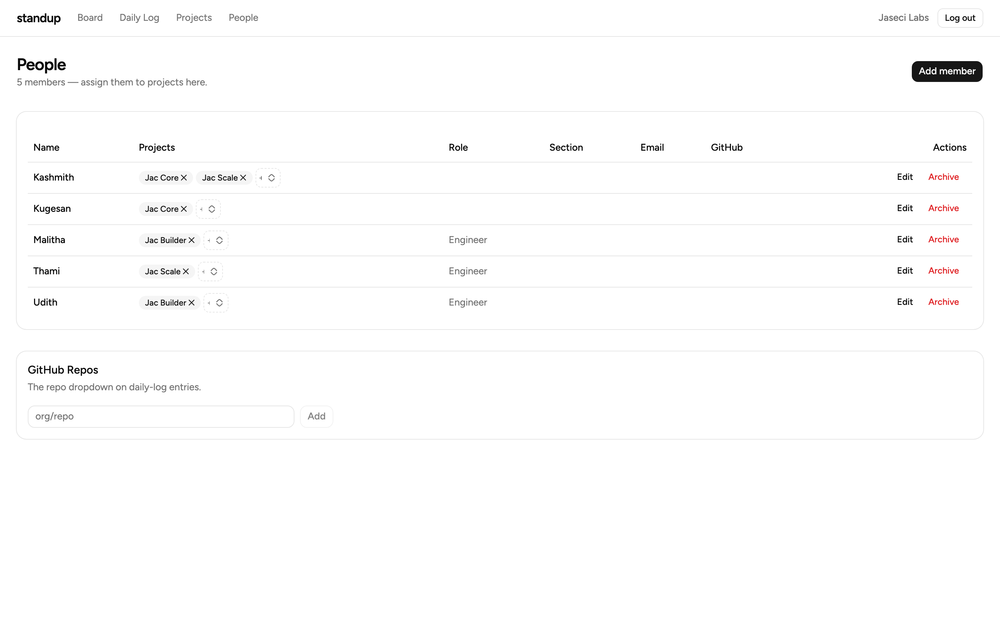
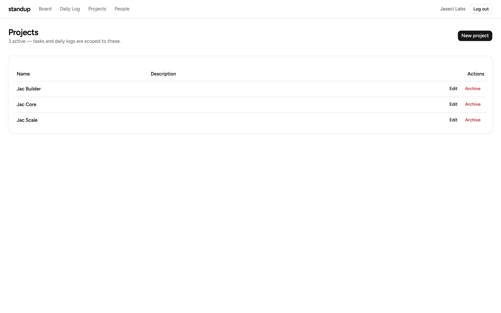

# standup

A multi-tenant kanban project tracker for Organization Owners - sign up, set up
your organization, create projects, and manage the people on them. Built
entirely in [Jac](https://www.jaseci.org/) (graph-native backend + JSX/React
client) with [jac-shadcn](https://github.com/jaseci-labs/jaseci) UI.


<details>
<summary><b>More screenshots</b></summary>

### Login



### Daily Log



### People



### Projects



</details>

## Running it

```bash
jac install              # deps (Python + npm) from jac.toml
jac start --dev main.jac # dev server with hot reload → http://localhost:8000
```

## Jac gotchas learned the hard way

- **A computed key does not survive a dict-literal spread.**
  `{**form, key: value}` compiles to `{...form, key: value}` — JavaScript sets
  a *literal* `"key"` property and the variable is ignored, so bound inputs
  silently freeze. Copy and subscript instead:
  `updated = {**form}; updated[key] = value; form = updated;`
- **Never name a module after an npm package it imports.**
  `components/ui/sonner.jac` importing `"sonner"` resolved to *itself* — a
  self-rendering Toaster that pinned the main thread in an infinite React
  mount loop. The wrapper lives in `toaster.jac`.
- **Keep Python imports out of any module the client imports types from.**
  A stray `import datetime` in `models.jac` dragged `@jac/wasm_host` into the
  browser bundle and broke the build; server-only helpers live in
  `walkers/util.jac`.
- **Elements inside `{if ...}` slots need explicit `key` props**, or React
  logs a list-key warning for every conditional branch.
- **`.jac/cache` can serve a stale build after editing an `.impl.jac`.** If a
  fix doesn't appear under `/compiled/...`, remove `.jac/cache` and
  `.jac/client/compiled`, then restart.
- **Kill stray servers before restarting.** A lingering `_bun/bun` child holds
  the API port, `jac start` silently drifts to the next port pair, and every
  walker call from the browser hangs.

## License

[MIT](LICENSE)
