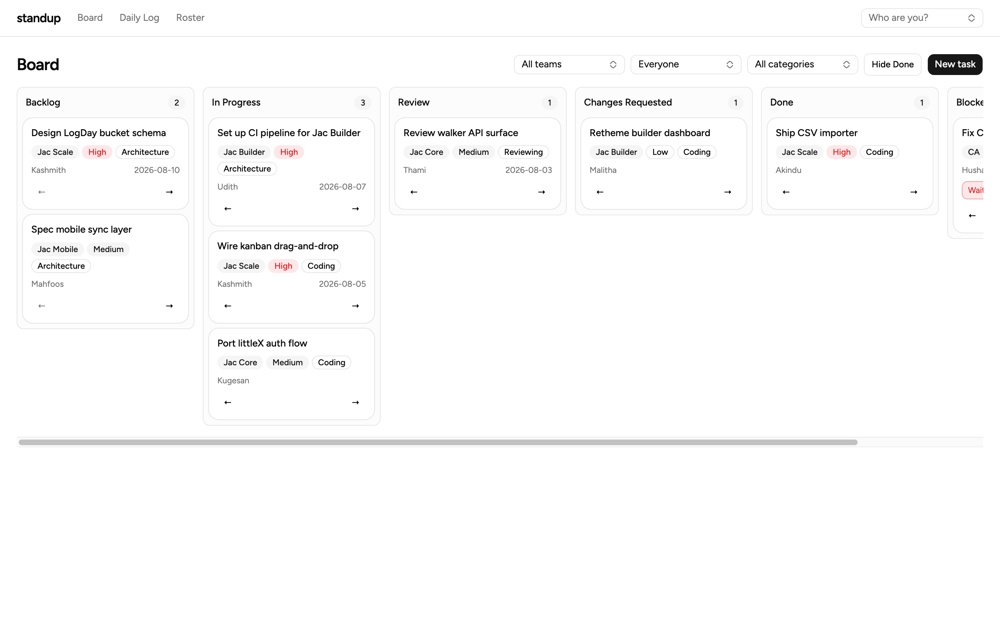
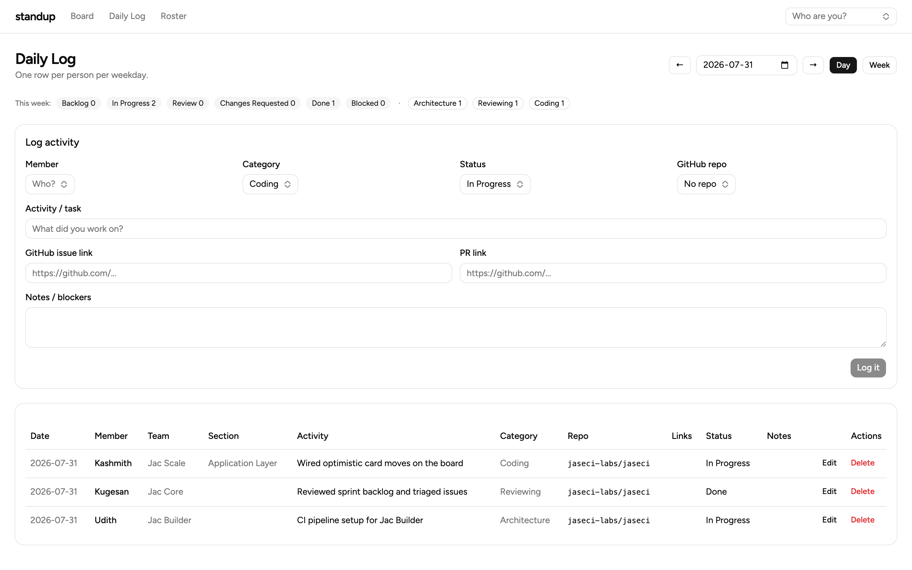
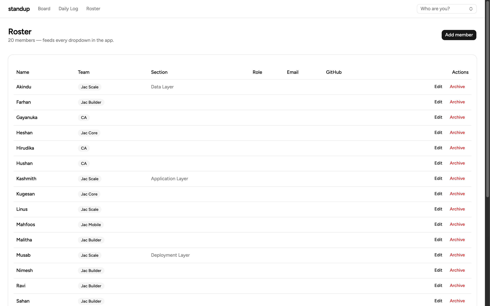

# standup

A kanban-style project tracker for the Jaseci Labs teams — replacing the shared
**Team Activity Tracker** spreadsheet with a real app. Built entirely in
[Jac](https://www.jaseci.org/) (full-stack: graph-native backend + JSX/React
client) with [jac-shadcn](https://github.com/jaseci-labs/jaseci) UI primitives.



## What it does

Three pages, one shared vocabulary (`Backlog · In Progress · Review · Changes
Requested · Done · Blocked`), no login — identity is a "Who are you?" picker,
the same trust model as the spreadsheet it replaces.

| Page | Replaces | Highlights |
|---|---|---|
| **Board** (`/`) | To Do List sheet | 6 status columns, native drag-and-drop **plus** ←/→ click-to-move on every card, optimistic moves with server-authoritative ordering, filters that default to *your* team, live column counts, 60s poll + refetch-on-focus |
| **Daily Log** (`/log`) | Daily Log sheet | One row per person per weekday with the exact sheet columns, form prefilled from the WhoAmI picker, day/week views, This-Week count strip |
| **Roster** (`/roster`) | Team Roster sheet | Members + GitHub repos CRUD; feeds every dropdown; archiving un-assigns open tasks but keeps history |

<details>
<summary><b>More screenshots</b></summary>

### Daily Log


### Roster


</details>

## Running it

```bash
jac install              # deps (Python + npm) from jac.toml
jac start --dev main.jac # dev server with hot reload → http://localhost:8000
```

Production: `jac start main.jac`.

## Migrating the spreadsheet

Export each sheet as CSV and feed it to the `ImportCsv` walker — it finds the
header row in a raw Excel export, reads the repos list from the roster sheet's
column G, dedupes on re-runs, normalizes off-vocabulary values, and backfills
assignees if you import sheets in the wrong order:

```bash
curl -X POST http://localhost:8000/walker/ImportCsv \
  -H 'Content-Type: application/json' \
  -d "$(jq -n --rawfile csv roster.csv '{sheet: "roster", csv_text: $csv}')"
# then the same with sheet: "todo" (and optionally sheet: "repos")
```

## How it's built

- **Server** ([endpoints.jac](endpoints.jac)) — persisted graph: `Member`,
  `Repo`, `Task`, `LogDay → LogEntry` nodes with typed edges (`AssignedTo`,
  `Logged`, `By`). The API is ~16 `walker:pub` endpoints; task mutations go
  through a `find_task` lookup base so a future `walker:priv` auth migration
  touches one place.
- **Client** ([pages/](pages/), [components/](components/)) — file-based
  routing, stateful-shell pages with handlers in `.impl.jac` annexes,
  [shadcn primitives](components/ui/) composed with Tailwind. Drag-and-drop is
  plain HTML5 DnD with a custom MIME type — no extra library.
- **Vocabulary** ([constants.jac](constants.jac)) — teams, statuses,
  categories, priorities as `glob` lists shared by client dropdowns and server
  validation. Adding a value is a data edit, not a schema migration.

See [PLAN.md](PLAN.md) for the full v1 design, the 0.34.6 gotchas baked into
the implementation, and the v2 roadmap (dashboard aggregates, GitHub API
integration, real accounts, log-from-card).

> **Jac tip learned the hard way:** don't name a module after an npm package it
> imports. `components/ui/sonner.jac` importing `"sonner"` resolved to *itself*,
> giving the Toaster an infinite render loop — the wrapper lives in
> `toaster.jac` instead.

## Status

v1 — no auth (run it on the internal network), last-write-wins concurrency,
dashboard deferred. The spreadsheet's job, done by an app.
