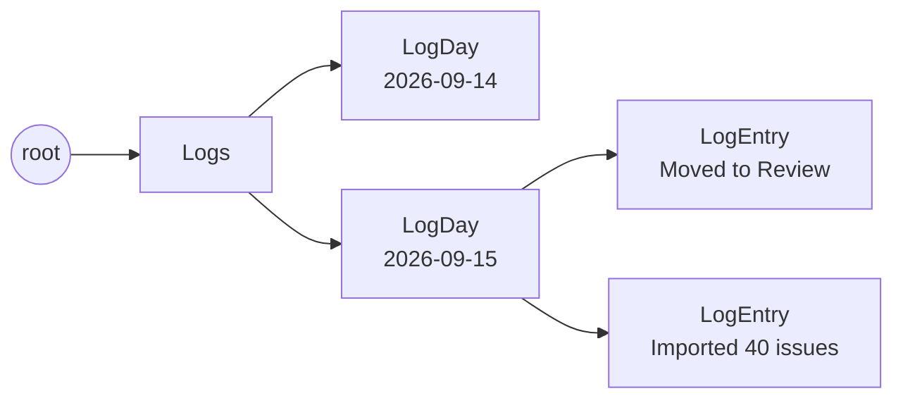

# The activity log

The log is the trail a task leaves as it travels the flow line. Task events
write it; nobody writes an entry by hand.
{ .fl-lede }

## Layout

There is one `LogDay` per date under the `Logs` box, and each entry hangs off
its day. Reading a date range asks the store for the days between two ISO
dates (`days_between`), so a week costs the same however long the history
grows. Each day keeps its tallies (`entry_total`, and `member_counts`: entries
per person named on them) and each entry a unique `sort_key` (its stamp as
digits, then its id), all written with the entry. A page of the log is cut in
the store, and the log's counts read the tallies, never the entries. A day
written before those fields existed is tallied once, on its first read, which
also folds a backfill it holds: more than ten single-issue import lines for
one repo and status become that day's batch line.

## What writes an entry

Every entry comes from a task event (`record_task_event`, and `log_imports`
for GitHub batches). An entry carries the task's id and title, category,
status after the change, issue and PR links, the project's name, and every
current assignee comma-joined as `member_name`. Its `activity` reads:

| Event | `activity` |
| --- | --- |
| `CreateTask` | `Added to Backlog` (the mapped status) |
| `MoveTask` onto another step | `Moved to Implement`, plus `· Priya Raman` for a handoff and `· closed org/repo #12` or `· reopened org/repo #12` when the move crossed Done on an `auto_close` repo |
| `UpdateTask` that changes status | `Moved to Done` |
| A merged PR or closed issue on an `auto_done` repo | `Moved to Done · PR merged` or `Moved to Done · issue closed` |
| One issue imported or auto-filed in a batch | `Imported from GitHub org/repo #12` |
| More than one in a batch (an import, a sync pass) | `Imported 40 issues from org/repo` (or `closed issues`), one line per day, repo and status; a later batch that day grows it |
| An issue opened from a task | `Opened GitHub issue org/repo #12` |
| A checklist item checked off | `Checked off: Draft the rollback steps (2/5)` |

The batch line carries no task: `item_count` holds its number of issues and
grows in place, so a backfill of 1,400 issues is one row, not 1,400.

A pure reorder inside a step writes nothing, and neither does deleting a task.
`SetMoveInfo` (the reviewer, PR link or blocker note a handoff asks for) does
not add an entry: it patches the move's entry from the same day with the new
links and note.

## Things to know when reading entries

!!! warning "`member_name` can hold several people"

    An entry names **every** assignee, joined with `", "`. Split it before
    comparing it to a member. The per-person counts do, so an entry with two
    assignees counts once for each.

- **Names are snapshots.** `member_name`, `tags` and `project_name` are copied
  when the entry is written. Renaming a member or project later does not
  rewrite history.
- **Timestamps are UTC.** `at` is an ISO timestamp ending in `Z`
  (`2026-09-15T08:12:33.123456Z`) and `date` is its day. Entries applied from a
  GitHub webhook carry the event's own time (merged, closed, submitted or
  updated), not the time the board next drained its queue, so they land on the
  day the change happened.
- **Entries are not edited or deleted** through the API. Older workspaces may
  hold hand-written entries from before the log was automatic; they read like
  any other entry.

## Where the log is read

- The task sheet's **Travel so far** reads one task's entries
  (`ListLogEntries` with `task_id`).
- The Overview counts entries per week, per weekday and per person (`logs`
  inside `OverviewSnapshot`), from the days' tallies.
- The assistant's snapshot counts the requested window from the days' counts
  and carries its newest 200 entries as activity lines.
- Insights use the latest `Blocked` entry's note as a blocked task's reason.

The walker is documented in the [Activity log API](../api/log.md).
