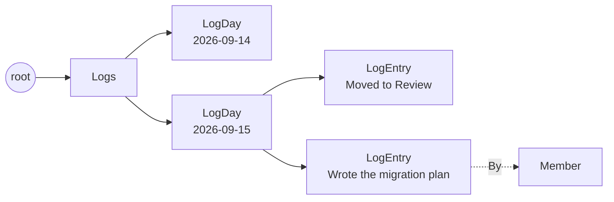

# The daily log

The log is what a standup would have said, written as the work
happens. The board writes most of it; people add the rest by hand.
{ .fl-lede }

## Layout

There is one `LogDay` per date under the `Logs` box, and each entry hangs off
its day. Reading a date range asks the store for the days between two ISO
dates (`days_between`), so a week costs the same however long the history
grows.

## Two writers

| Writer | When | `member_name` | `By` edge |
| --- | --- | --- | --- |
| **The board** (`record_task_event`) | A task is created or changes column, a handoff reassigns it, GitHub moves or imports it | Every current assignee, comma-joined | No |
| **A person** (`LogActivity`) | Someone adds an entry on `/log` | The chosen member | Yes |

Automatic entries carry the task's id and title, category, status after the
change, issue and PR links, and the project's name. Their `activity` reads:

| Event | `activity` |
| --- | --- |
| `CreateTask` | `Added to Backlog` (the mapped status) |
| `MoveTask` onto another column | `Moved to Implement`, plus `· Priya Raman` for a handoff and `· closed org/repo #12` when the move closed an issue |
| `UpdateTask` that changes status | `Moved to Done` |
| A merged PR or closed issue on an auto-done repo | `Moved to Done · PR merged` or `Moved to Done · issue closed` |
| An issue imported or auto-filed | `Imported from GitHub org/repo #12` |
| An issue opened from a card | `Opened GitHub issue org/repo #12` |

A pure reorder inside a column writes nothing, and neither does deleting a
task. `SetMoveInfo` (the reviewer, PR link or blocker note a handoff asks for)
does not add an entry: it patches the move's entry from the same day with the
new links and note.

## Things to know when reading entries

!!! warning "`member_name` can hold several people"

    An automatic entry names **every** assignee, joined with `", "`. Split it
    before comparing it to a member. `LogCounts` does, so an entry with two
    assignees counts once for each.

- **Names are snapshots.** `member_name`, `tags` and `project_name` are copied
  when the entry is written. Renaming a member or project later does not
  rewrite history.
- **Timestamps are UTC.** `at` is an ISO timestamp ending in `Z`
  (`2026-09-15T08:12:33.123456Z`) and `date` is its day. Entries applied from a
  GitHub webhook carry the event's own time (merged, closed, submitted or
  updated), not the time the board next drained its queue, so they land on the
  day the change happened.
- **Editing overwrites every editable field.** `UpdateLogEntry` replaces
  activity, category, repo, links, status and notes together; send the whole
  entry back, not only what changed. The date, author and task link are never
  edited.
- **Deleting is by id list.** `DeleteLogEntries` removes the owned entries it
  was given and reports which ids it actually deleted.

## Where the log is read

- `/log` pages entries for a date range (`ListLogEntries`, newest day first).
- The Overview counts entries per week, per weekday and per person
  (`LogCounts`, and `logs` inside `OverviewSnapshot`).
- The assistant's snapshot includes every entry in the requested window as an
  activity line.
- Insights use the latest `Blocked` entry's note as a blocked task's reason.

The walkers are documented in the [Daily log API](../api/log.md).
