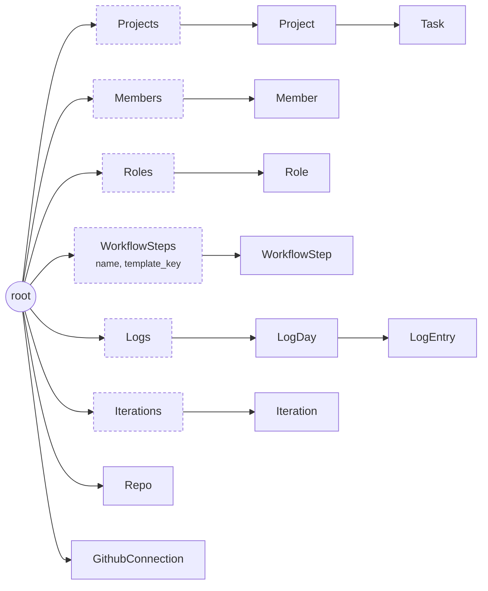
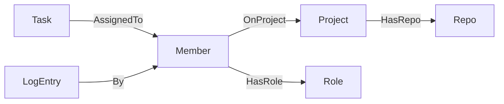

# Data graph

Every workspace is a graph under its account's root. Rows live
in boxes, a container edge says who owns what, and a handful of typed edges
link rows across boxes. This page is generated from `models.jac`
where it lists fields, so it cannot drift from the code.
{ .fl-lede }

## The shape of a workspace

**Containment.** Every row hangs under a box, and every box under the root.
These are plain `++>` edges from parent to child.

**Typed edges.** Five edges declared in `models.jac` link rows across boxes.

| Layout | Meaning |
| --- | --- |
| `root ++> Projects ++> Project ++> Task` | A task's project **is** its container. Every task has exactly one project, and moving a task to another project re-homes it. |
| `root ++> Members ++> Member` | The roster. Members are archived (`active = false`), never deleted. |
| `root ++> Roles ++> Role` | Org-level roles; a member holds one through a `HasRole` edge. |
| `root ++> WorkflowSteps ++> WorkflowStep` | The flow line. The box also carries the flow line's display name and the template that seeded it. |
| `root ++> Logs ++> LogDay ++> LogEntry` | The daily log, one `LogDay` per date. |
| `root ++> Iterations ++> Iteration` | Time boxes the team plans in; a task points at one through `iteration_id`. |
| `root ++> Repo`, `root ++> GithubConnection` | Repos and the GitHub App installation hang off the root directly. |

## Design rules

### Boxes, made on first write

One box per kind sits under the root. Writers get or create it through a helper
(`projects_box(root)`, `members_box`, `roles_box`, `steps_box`, `logs_box`,
`iterations_box`);
reads look it up and return nothing when it is absent, so a read never writes.
Two overlapping first writes can leave two boxes of one kind, so the cross-kind
readers (`projects_of`, `members_of`, `roles_of`, `steps_of`, `iterations_of`,
the task readers)
merge every box while writers always take the first.

### The working set is a query, the totals are tallies

The task readers push their predicates into the store's query, so a request
loads only the rows it returns or counts over: `open_tasks`, `done_since`
and `working_tasks` (the board's open plus recently Done rows), `created_since`
for a chart's window, `done_before` for the "+N older" history, and the
GitHub lookups by repo and number. All-time totals are kept on write instead
of counted: `Project.task_total`, `done_total` and `seeded_done_total`
(tasks created already Done, history rather than throughput), and
`Projects.categories`. `ensure_tallies` fills them once for a project that
has none yet (`tallies_at` empty) and every counting walker calls it first.
A write made in a request is not visible to a pushed query later in the same
request, only to the next one, so a walker that writes and then looks the
same row up keeps it in a local instead.

### Containment is ownership

[`owned(holder, target)`](security.md#resolution-is-not-authorization) climbs
container edges, at most three hops (task, project, box; or log entry, day,
box), and compares each parent with the caller's root. Typed edges never lead
to a container, so they cannot make a foreign row look owned.

### Links that are fields, not edges

Some references are stored as jid strings on purpose:

| Field | Why not an edge |
| --- | --- |
| `Task.step_id` | Empty on tasks older than flow lines and on tasks whose step was deleted. The board falls back to `status`. |
| `Task.iteration_id` | Keeps list rows free of edge hops. `DeleteIteration` clears it on every task that pointed at the iteration. |
| `Task.project_id`, `assignee_ids` | The container project and the `AssignedTo` targets, kept in step with the edges at every write so a list row needs no hop. The edges stay the truth: `owned` climbs the container edge, `ArchiveMember` finds tasks through `AssignedTo`. |
| `Task.checklist` | The card's own `{id, text, done}` items, written only by the checklist walkers. |
| `WorkflowStep.transitions` | A list of `{to, label, carries}`. Cycles are allowed, so a step can point back upstream. Deleting a step strips its id from every other step's list. |
| `Task.reviewer_id`, `reviewer_name` | A snapshot of who was asked to review. |
| `Task.gh_parent_repo`, `gh_parent_number` | GitHub sub-issue family. An edge would cost a traversal per row in every list. |
| `LogEntry.task_id`, `member_name`, `project_name` | The log is history: names are snapshotted when the entry is written. |

### Ids

Every node has a **jid**, the string the API uses as `id`, `task_id`,
`project_id` and so on. View objects carry it as `id`. A walker that reports a
raw node (a `Project` or a `LogEntry`) serialises every field plus the
runtime's `_jac_id`. `resolve(id)` turns a jid back into a node and returns
`None`, never an exception, for an empty, malformed, unknown or foreign id.

### Not in the graph

Two collections live in the runtime's shared **docs store** instead, because a
webhook arrives with no tenant attached:

| Collection | Key | Holds |
| --- | --- | --- |
| `gh_installations` | installation id | `root_jid` (the workspace that last connected it), `bound_at`, `webhook_seen_at` |
| `gh_deliveries` | GitHub delivery id | One queued webhook delivery, its `outcome` and `applied_at`. Applied rows are purged after about a week. |

See [GitHub sync](github-sync.md).

## Nodes

::: node Project h3

::: node Task h3

::: node Member h3

::: node Role h3

::: node WorkflowSteps h3

::: node WorkflowStep h3

::: node Logs h3

::: node LogDay h3

::: node LogEntry h3

::: node Iteration h3

::: node Repo h3

::: node GithubConnection h3

::: node Projects h3

::: node Members h3

::: node Roles h3

::: node Iterations h3

## Typed edges

::: edges models.jac

Each edge carries no fields. A task's project and a row's box are plain
container edges, not typed ones.
