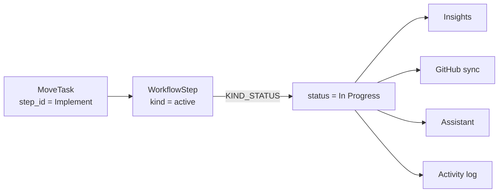
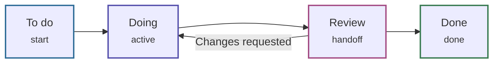
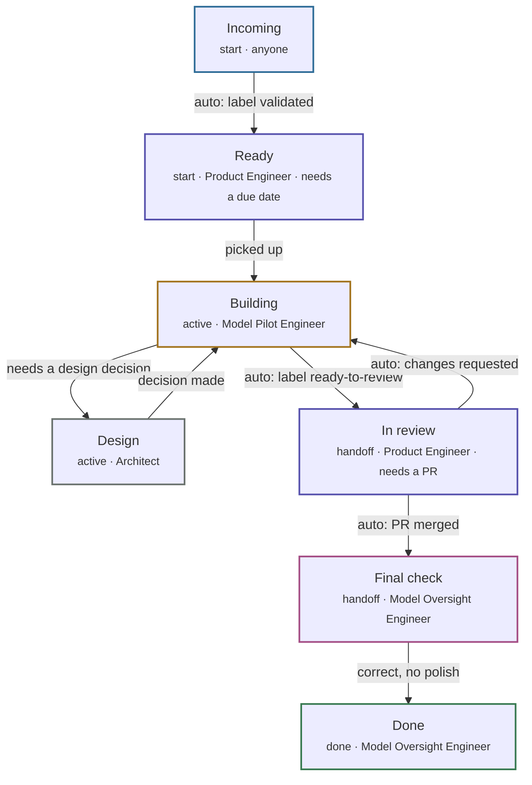

# Flow lines

An organization draws its own steps on `/flowlines`,
connects them however work really moves, and the board's step groups
**are** those steps. The two views cannot disagree because they
read the same nodes.
{ .fl-lede }

!!! note "Naming"

    The feature was called "workflow" until August 2026. The archetypes kept
    that name (`WorkflowStep`, `WorkflowSteps`) because moving or renaming a
    declaration orphans stored data.

## Steps and kinds

A step is a `WorkflowStep` node under the `WorkflowSteps` box. It has a name
the team chose, a colour, an owner **role** (not a person), a one-line blurb, a
canvas position and a `sort_order`. Behind the name sits a semantic **kind**:

| Kind | Means | Legacy status written | Default colour |
| --- | --- | --- | --- |
| `start` | Not started | `Backlog` | <span class="fl-step fl-step--sky">sky</span> |
| `active` | Someone is on it | `In Progress` | <span class="fl-step fl-step--indigo">indigo</span> |
| `handoff` | Waiting on another person (review) | `Review` | <span class="fl-step fl-step--amber">amber</span> |
| `blocked` | Stopped, needs attention | `Blocked` | <span class="fl-step fl-step--rose">rose</span> |
| `done` | Terminal | `Done` | <span class="fl-step fl-step--emerald">emerald</span> |

The app keys behaviour on the kind, never the name, so renaming "Review &amp;
merge" to "Code review" changes nothing about how tasks behave.

::: glob KIND_STATUS

::: glob STATUS_KIND

## Why every move writes two fields

Roughly thirty places in the code care what a status *means*: Done is terminal,
Blocked needs attention, Review is a handoff. Rather than teach insights, the
GitHub sync, the assistant and the log what a step is, **every task write sets
`step_id` and the legacy `status` mapped through `KIND_STATUS`**. Those
subsystems keep reading `status`.



`Changes Requested` is the one legacy status with no kind of its own; it maps
back to `active`.

### Done has a date

Every status write goes through `Task.set_status(status, stamp)`, never a plain
assignment. It stamps `done_at` when a task enters Done and clears it when the
task leaves. The done day is `done_at` (falling back to `updated_at` on rows
written before the stamp existed), and a task created straight into Done is
history rather than throughput. A closed issue from a GitHub import carries the
issue's own created and closed dates, so it counts in the week it was really
closed. The Overview's weekly counts, the burn-up charts, the assistant's
snapshot and the board's recent-done window all read that one rule, so they
agree.

## Transitions

A step stores its outgoing transitions in its own `transitions` field, in draw
order, one entry per target:

```json
{"to": "<target step jid>", "label": "ready and tested", "carries": "pr"}
```

- `label` says what has to be true to cross.
- `carries` is `issue` (no code yet), `pr` (code, waiting on a person) or
  empty.
- Cycles and branches are allowed on purpose; a self-loop is refused.
- There are no edges between steps. Incoming transitions are computed by
  reading every step's list (`StepView.prev_ids`), and a transition that
  points at a deleted step is dropped from the view.

## Templates

Two templates ship in `FLOW_LINE_TEMPLATES`. Setup's last step offers both plus
Draw my own, and the flow line page offers both plus a blank canvas whenever
there are no steps. `ApplyTemplate` only seeds an **empty** flow line;
if any step exists it reports the existing steps and writes nothing. The
template's key is stored as the box's `template_key`, so a template can be
renamed but never re-keyed.

### Simple (`simple`)

The recommended start: four steps, and Review can send work back to Doing. It
seeds no roles and no step owners.



### Software team (`jaseci`)

Seven steps from the GitHub issue pool to Done. Work stays an issue until an
engineer picks it up and opens a PR; from there it is a PR until the Model
Oversight Engineer marks it done. Arrows marked *auto* move work on their own
(see [Automation](#automation)).



Software team also seeds four roles (Product Engineer, Model Pilot Engineer,
Architect, Model Oversight Engineer) as ordinary `Role` nodes that the team
can edit afterwards. Existing roles with the same name are left alone, and
the box records `template_key = "jaseci"`.

## Automation

Two settings on the flow line itself make it act on its own; both are edited
on `/flowlines` in Edit mode.

**Entry rules** on a step (`needs_due_date`, `needs_pr`, set with
`SetStepRules`) turn a task away unless it has a due date or a linked PR.
They hold for every move onto the step: a board drag, a sheet save, a new
task and a GitHub trigger. The page stops the move before sending it and the
server refuses it too (`refused` on the reported task view).

**Triggers** on a transition (`trigger`, `trigger_label`) move a task across
the arrow when the GitHub sync or a webhook drain sees the fact, only from
the step the arrow leaves:

| Trigger | Fires when |
| --- | --- |
| `label` | The named label is newly added to the task's issue or its linked PR |
| `pr_merged` | The linked PR merges |
| `changes_requested` | A review on the linked PR requests changes |

A triggered move lands like a drag: the end of the target column, the step's
owner takes the task when exactly one person holds that role on the project,
and the log reads `Moved to <step> · <why>`. When the target's entry rule
turns it away the task stays and the log reads `Stayed on <step> · <reason>`.
A PR is linked to its task when its body closes the issue (`Closes #12`,
`fixes org/repo#12`); see [GitHub sync](github-sync.md).

??? example "The templates as declared in `constants.jac`"

    ::: glob FLOW_LINE_TEMPLATES

## Where a task sits on the board

Tasks written before flow lines existed, and tasks whose step was deleted,
carry an empty `step_id`. Both fallbacks below are load-bearing.

1. **`step_id` names an existing step:** the task sits on that step.
2. **Otherwise:** the task sits on the first step whose kind is
   `STATUS_KIND[status]` (a Blocked task goes to the first `blocked` step).
3. **No step of that kind exists:** the flow line's counts leave the task out,
   and the board draws it in its first step group.
4. **No flow line at all:** the board falls back to the legacy `STATUSES` as
   groups, and a task's `status` is its group.

!!! info "First, by which order?"

    The server takes the first step of a kind by `sort_order`; the board
    orders its step groups by canvas `x`, then `sort_order`. They agree unless a step
    of the same kind was created later but sits further left.

## Handoffs follow roles

A step's `owner` is a role name such as `Model Pilot Engineer`. When `MoveTask` moves a task
**onto a different step**, it looks for the one active member who holds that
role **and** is on the task's project. If there is exactly one, the task's
assignees are replaced by that person and the log line names them
(`Moved to Implement · Priya Raman`). With no owner, `anyone`, no project, or
zero or several holders, the assignees are left alone. Reordering a task
within its own step is never a handoff.

## Editing rules

| Action | What happens |
| --- | --- |
| Rename a step | Nothing else changes; behaviour follows the kind. |
| Change a step's kind | Every task whose `step_id` is that step gets the new mapped `status` (no log line, no `updated_at` bump). |
| Move a step on the canvas | `MoveStep` stores `x` and `y`; a coordinate outside 0..20000 is reset to 0. |
| Delete a step | Refused for the only `start` or only `done` step. Otherwise tasks on it keep their `status` and fall back per the rules above, and every transition into it is removed. |
| Delete the flow line | Every step and transition goes, tasks keep their `status`, and `template_key` resets so the picker appears again. Roles stay. |
| Rename or delete a role | A rename rewrites every step `owner` that used the old name; a delete clears it. Members follow through their `HasRole` edge. |

The walkers are documented in the [Flow lines API](../api/flow-lines.md).
