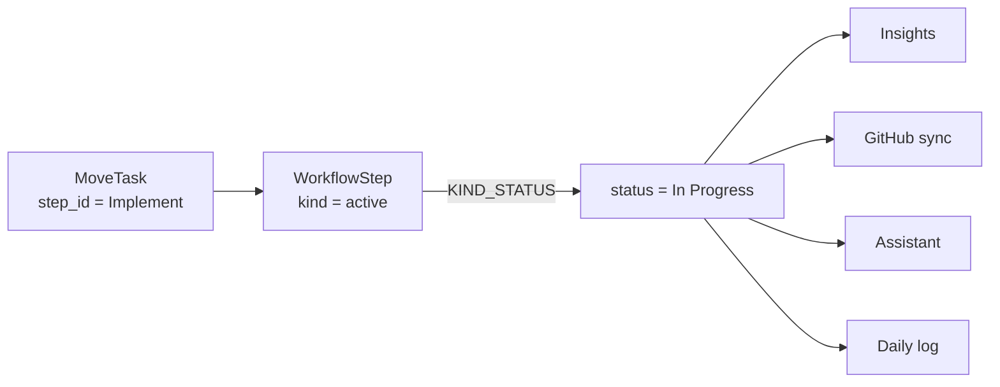
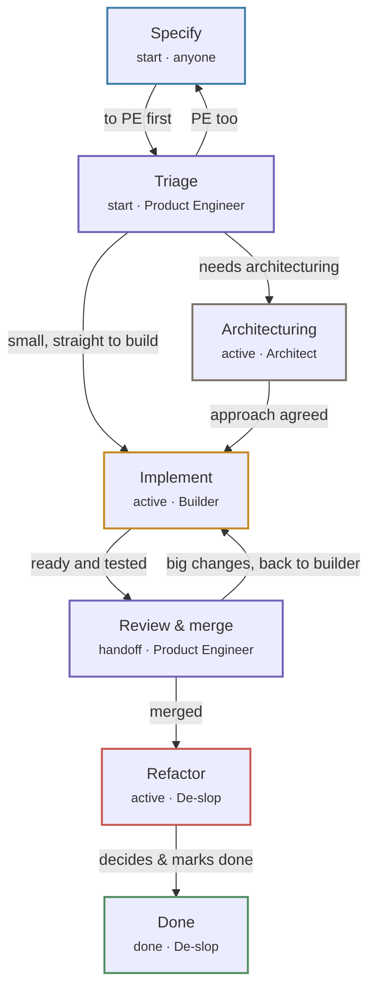

# Flow lines

An organization draws its own steps on `/flowlines`,
connects them however work really moves, and the board's columns
**are** those steps. The two views cannot disagree because they
read the same nodes.
{ .fl-lede }

!!! note "Naming"

    The feature was called "workflow" until August 2026. The archetypes kept
    that name (`WorkflowStep`, `WorkflowSteps`) because moving or renaming a
    declaration orphans stored data, and `/workflow` redirects to
    `/flowlines` for old links.

## Steps and kinds

A step is a `WorkflowStep` node under the `WorkflowSteps` box. It has a name
the team chose, a colour, an owner **role** (not a person), a one-line blurb, a
canvas position and a `sort_order`. Behind the name sits a semantic **kind**:

| Kind | Means | Legacy status written | Default colour |
| --- | --- | --- | --- |
| `start` | Not started | `Backlog` | <span class="fl-step fl-step--sky">sky</span> |
| `active` | Someone is on it | `In Progress` | <span class="fl-step fl-step--indigo">indigo</span> |
| `handoff` | Waiting on another person (review) | `Review` | <span class="fl-step fl-step--amber">amber</span> |
| `blocked` | Stopped, needs attention | `Blocked` | <span class="fl-step fl-step--rose">rose</span> |
| `done` | Terminal | `Done` | <span class="fl-step fl-step--emerald">emerald</span> |

The app keys behaviour on the kind, never the name, so renaming "Review &amp;
merge" to "Code review" changes nothing about how cards behave.

::: glob KIND_STATUS

::: glob STATUS_KIND

## Why every move writes two fields

Roughly thirty places in the code care what a status *means*: Done is terminal,
Blocked needs attention, Review is a handoff. Rather than teach insights, the
GitHub sync, the assistant and the log what a step is, **every task write sets
`step_id` and the legacy `status` mapped through `KIND_STATUS`**. Those
subsystems keep reading `status`.



`Changes Requested` is the one legacy status with no kind of its own; it maps
back to `active`.

### Done has a date

Every status write goes through `Task.set_status(status, stamp)`, never a plain
assignment. It stamps `done_at` when a task enters Done and clears it when the
task leaves. The done day is `done_at` (falling back to `updated_at` on rows
written before the stamp existed), and a task created already Done, such as a
closed issue from a GitHub back-fill, is history rather than throughput. The
Overview's weekly counts, the burn-up charts and the assistant's snapshot all
read that one rule, so they agree.

## Transitions

A step stores its outgoing transitions in its own `transitions` field, in draw
order, one entry per target:

```json
{"to": "<target step jid>", "label": "ready and tested", "carries": "pr"}
```

- `label` says what has to be true to cross.
- `carries` is `issue` (no code yet), `pr` (code, waiting on a person) or
  empty.
- Cycles and branches are allowed on purpose; a self-loop is refused.
- There are no edges between steps. Incoming transitions are computed by
  reading every step's list (`StepView.prev_ids`), and a transition that
  points at a deleted step is dropped from the view.

## Templates

The picker offers one template or a blank canvas. `ApplyTemplate` only seeds an
**empty** flow line; if any step exists it reports the existing steps and
writes nothing.



The Jaseci flow also seeds four roles (Product Engineer, Builder, Architect,
De-slop) as ordinary `Role` nodes that the team can edit afterwards. Existing
roles with the same name are left alone, and the box records
`template_key = "jaseci"`.

??? example "The template as declared in `constants.jac`"

    ::: glob FLOW_LINE_TEMPLATES

## Where a task sits on the board

Tasks written before flow lines existed, and tasks whose step was deleted,
carry an empty `step_id`. Both fallbacks below are load-bearing.

1. **`step_id` names an existing step:** the task sits on that step.
2. **Otherwise:** the task sits on the first step whose kind is
   `STATUS_KIND[status]` (a Blocked task goes to the first `blocked` step).
3. **No step of that kind exists:** the flow line's counts leave the task out,
   and the board draws it in its first column.
4. **No flow line at all:** the board falls back to the legacy `STATUSES` as
   columns, and a task's `status` is its column.

!!! info "First, by which order?"

    The server takes the first step of a kind by `sort_order`; the board
    orders columns by canvas `x`, then `sort_order`. They agree unless a step
    of the same kind was created later but sits further left.

## Handoffs follow roles

A step's `owner` is a role name such as `Builder`. When `MoveTask` moves a card
**onto a different step**, it looks for the one active member who holds that
role **and** is on the task's project. If there is exactly one, the card's
assignees are replaced by that person and the log line names them
(`Moved to Implement · Priya Raman`). With no owner, `anyone`, no project, or
zero or several holders, the assignees are left alone. Reordering a card
within its own column is never a handoff.

## Editing rules

| Action | What happens |
| --- | --- |
| Rename a step | Nothing else changes; behaviour follows the kind. |
| Change a step's kind | Every task whose `step_id` is that step gets the new mapped `status` (no log line, no `updated_at` bump). |
| Move a step on the canvas | `MoveStep` stores `x` and `y`; a coordinate outside 0..20000 is reset to 0. |
| Delete a step | Refused for the only `start` or only `done` step. Otherwise tasks on it keep their `status` and fall back per the rules above, and every transition into it is removed. |
| Delete the flow line | Every step and transition goes, tasks keep their `status`, and `template_key` resets so the picker appears again. Roles stay. |
| Rename or delete a role | A rename rewrites every step `owner` that used the old name; a delete clears it. Members follow through their `HasRole` edge. |

The walkers are documented in the [Flow lines API](../api/flow-lines.md).
