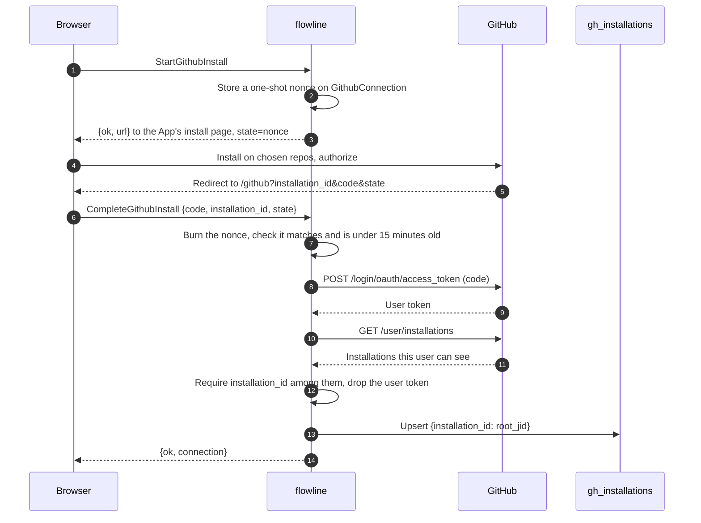

# GitHub sync

Three paths keep a board in step with GitHub: signed webhooks
deliver changes within seconds, the workspace drains its own queue, and a
reconcile poll on a server schedule catches anything the webhook missed. No
page load calls GitHub.
{ .fl-lede }

```mermaid
flowchart LR
    gh["GitHub"]
    subgraph runtime["jac run"]
        rx["GithubEvent<br/><small>system identity</small>"]
        drain["DrainGithubEvents<br/><small>every 20 s on a live, open board</small>"]
        sync["SyncGithub<br/><small>every 5 min per workspace, and Sync now</small>"]
    end
    idx[("gh_installations")]
    q[("gh_deliveries")]
    graph[("Workspace graph")]

    gh -- "signed delivery" --> rx
    rx -- "installation bound?" --> idx
    rx -- "insert" --> q
    drain -- "own rows, oldest first" --> q
    drain --> graph
    sync -- "drain first" --> q
    sync -- "GET /repos/.../issues since cursor" --> gh
    sync --> graph
```

## Connecting an installation



The page strips the query string and starts `CompleteGithubInstall` **before**
its first `await`, keeping the one in-flight promise in module state. A full
page load mounts an app page twice, and two concurrent completions would race
GitHub's single-use OAuth code.

The last workspace to complete a connection owns the installation in the
index. `GithubStatus` quietly re-binds a valid connection whose index row is
missing, but never takes over a row another workspace holds.

## Live deliveries

### The receiver

`POST /webhook/GithubEvent` is checked by the runtime before any app code runs:
body size (`413`), signature (`401`), and content type (`415` unless
`application/json`). The walker then decides, in order:

| Check | Response `outcome` |
| --- | --- |
| A `ping` | `ping` |
| No workspace has bound this installation id | `unknown_installation` |
| *(marks the installation as live: `webhook_seen_at`)* | |
| Sent by the App itself (`<slug>[bot]`) | `echo` |
| Not one of the handled event kinds | `unsupported` |
| Inserted into the queue | `queued` |
| Same delivery id already queued | `duplicate` |
| The docs store failed | `unavailable` (with `ok: false`) |

The response body is what the App's delivery log shows. GitHub does not retry a
failed delivery on its own; the **Redeliver** button does.

### The drain

`drain_deliveries` runs in the workspace's own session, from
`DrainGithubEvents` (an open, visible board calls it every 20 seconds while
deliveries are live, otherwise once a minute) and at the start of every
`SyncGithub`, scheduled or manual. It returns immediately unless the index binds
the installation to **this** root. Then it applies up to 200 queued rows,
oldest first, and marks each with its outcome. A row that fails is not retried;
the reconcile poll repairs the task.

Before applying an issue, PR or review, the drain compares GitHub's
`updated_at` (or `submitted_at`) with the newest one already applied to that
task and drops anything not newer (`stale`). The log entry is stamped with the
event's own time.

### What each event does

| Event | Effect on the board |
| --- | --- |
| `issues` opened, closed, reopened, assigned, labeled... | For an unlinked issue on an `auto_sync` repo with a project: a new task on the first start step (closed issues land on Done). For a linked task: the issue state, GitHub's assignees and the sub-issue counts. A close on an `auto_done` repo moves the card to the done step. |
| `issues` deleted or transferred | The task is unlinked from the issue (`gh_issue_number = 0`). |
| `pull_request` | The linked task's PR state (`open`, `draft`, `closed`, `merged`). A merge on an `auto_done` repo moves a card that is In Progress or in Review to done. `review_requested` marks the review as requested. |
| `pull_request_review` | `approved` or `changes_requested` becomes the task's review state. Comments and dismissals are ignored. |
| `sub_issues` | Links or unlinks a child task's parent and refreshes the parent's done/total counts. |
| `installation` deleted, suspended, unsuspended | Marks the connection invalid (and unbinds it on delete) or valid again. |
| `installation_repositories` removed | Turns off `auto_sync`, `auto_done` and `auto_close` for those repos. Tasks and links stay. |

!!! note "What does not sync"

    - Editing an issue's title, body or labels does not rewrite the task.
    - GitHub's assignees are recorded as `gh_assignees`; the card's own
      assignees (roster members) stay the workspace's to set.
    - Pull request events never create tasks. Link a PR by pasting its URL
      into the task or through an imported issue.

## The reconcile poll

`SyncGithub` runs on a **server schedule, every 5 minutes**, once per connected
workspace in that workspace's own root (`sync_connected_workspaces` in
`services/github/schedule.jac`; the [operations page](../deploy/operations.md#the-scheduled-github-sync)
has the constants and the lease). Opening a page never triggers it. The pass
polls on a cooldown: **every 15 minutes while deliveries are flowing** (one
arrived in the last hour), **every tick otherwise**; a workspace nobody opens
catches up all the same. **Sync now** on `/github` and the board's Sync button
run the same walker by hand and ignore the cooldown. It catches history from
before the webhook existed and anything delivered while the app was down.

1. Drain the queue (as above).
2. Mint an installation token (only now: a pass on cooldown makes no GitHub call).
3. For each tracked repo, read `GET /repos/{repo}/issues?state=all&sort=updated&direction=asc`
   from the repo's `issue_cursor` (the newest `updated_at` already seen).
    - An `auto_sync` repo with no cursor back-fills from the beginning.
    - A repo without `auto_sync` is polled only from the earliest sync of a
      task already linked to it, and skipped if it has none.
4. Apply every item through the same helpers the drain uses, and advance the
   cursor after each fully applied page.
5. Stop at the page budget (5 pages of 100 by default) or 8 seconds and report
   `has_more`, so the client (or the next tick) calls again.
6. A pass that reached the end of every stream rewrites the stored **open
   issue and pull request pages** of each tracked repo (`lists` in the
   report), which is what `/github` renders.

It also adopts hand-pasted PR links: a task whose `pr_link` points at a pull
request in a tracked repo gets its `pr_number` filled in.

## What the GitHub page reads

`ListRepoIssues` and `ListRepoPulls` answer page 1 from the page the sync
stored (`synced_at` says when; `stale` past 20 minutes or when nothing is
stored yet) and never call GitHub on their own. The page reads a repo that has
no stored page yet once with `refresh`, and its **Refresh** button does the
same on demand; a later page (Load more), a search and an import still call
GitHub, each on an explicit action.

## Per-repo policy

Each flag is a switch in the repository's automation panel on `/github`.

| Flag | Switch | Default | Effect |
| --- | --- | --- | --- |
| `auto_sync` | Import issues into *project* | off | File new issues as tasks. Turning it on clears the cursor, so the next sync back-fills the repo's history. |
| `auto_done` | Move a card to Done when its issue closes or its pull request merges | off | A closed issue, or a merged PR on a card In Progress or in Review, moves the card to the done step. |
| `auto_close` | Close the issue when its card moves to Done | off | A card landing on Done closes its GitHub issue; a card leaving Done reopens it. |

## Writing back to GitHub

flowline writes to GitHub in exactly two cases:

1. **Opening an issue from a task** (`CreateIssueFromTask`), an explicit action.
2. **Keeping an issue's state with its card**, only on repos with
   `auto_close`, inside `MoveTask` and `UpdateTask`: a move that lands on Done
   closes the issue, and a move that leaves Done reopens it. The write is noted
   on the move's own log line (`Moved to Done · closed org/repo #12`,
   `Moved to Implement · reopened org/repo #12`).

GitHub then sends an `issues.closed` or `issues.reopened` delivery for that
write, sent by `<slug>[bot]`, and the receiver drops it as an `echo`, so the
card is not moved or logged twice. The other direction is deliberately
one-way: an issue reopened on GitHub does not move its card, and titles,
assignees and labels are never written back.

## When a connection goes invalid

A GitHub call that returns `401` or `404` marks the connection
`status = "invalid"`: the GitHub page shows a reconnect banner and
close-on-done stops. Reconnecting from that banner, or an `installation.unsuspend`
delivery, sets it back to `ok`.
