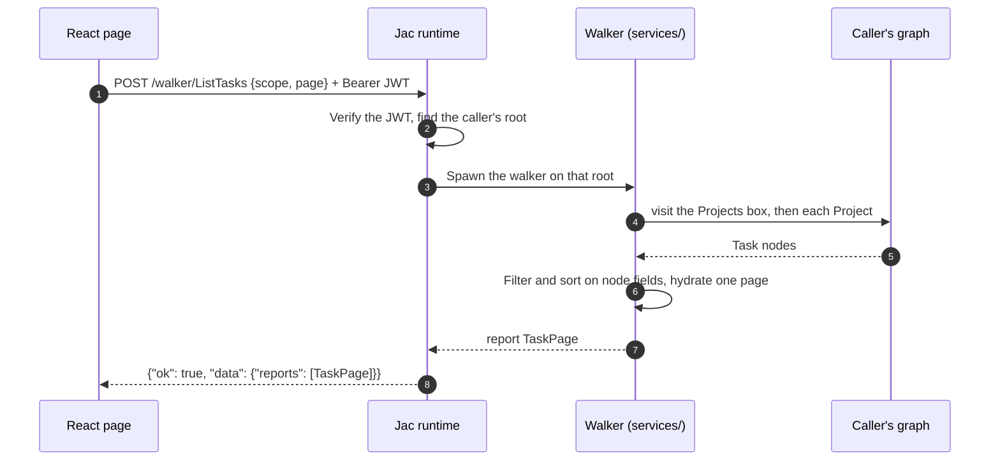

# Architecture

flowline is a multi-tenant kanban board and daily log, written as
one Jac project. A graph-native backend of walkers and a React client compile
from the same source tree and are served by one `jac run`
process.
{ .fl-lede }

## The account is the organization

There is no `Organization` node. Signing up creates an account, the runtime
gives that account its own graph **root**, and everything the organization owns
hangs under that root: projects, tasks, the roster, roles, the flow line, the
log and the GitHub connection. The organization's name lives in the account
profile (`GET` and `PATCH /user/me`).

The people a workspace tracks are **roster members**, not accounts. Members
never sign in; the assistant always writes about them in the third person.

## A request, end to end



Because the walker starts on the caller's own root, a traversal simply cannot
reach another tenant's nodes. Isolation is structural, not a filter someone
could forget. Read [Tenancy and security](security.md) for the one rule that
still has to be followed by hand.

## Server

| Path | Holds |
| --- | --- |
| `models.jac` | Every `node`, `edge` and `obj` archetype, plus the graph helpers (`owned`, the `*_box` get-or-create helpers, the `*_of` readers, the pushed task readers such as `open_tasks` and `done_since`, the tally helpers, `hydrate_rows`). Nothing else, and no Python imports. |
| `services/<section>/` | The API, one folder per section: `projects`, `roster`, `tasks`, `board`, `log`, `flowlines`, `iterations`, `insights`, `assistant`, `github`. `services/util.jac` holds shared server-only helpers such as `now_iso` and `page_bounds`. |
| `constants.jac` | The vocabularies shared by client dropdowns and server validation: `STATUSES`, `PRIORITIES`, `STEP_KINDS`, `KIND_STATUS`, `FLOW_LINE_TEMPLATES` and friends. |
| `main.jac` | The entry point. **Its import list is the router**: a walker missing from it returns 404. |

!!! danger "Never move an archetype"

    A persisted node's identity includes the module path of its declaration.
    Moving `node Task` out of `models.jac` would orphan every stored task.
    That is also why the flow line's archetypes are still called
    `WorkflowStep` and `WorkflowSteps`: the feature was renamed, the
    declarations were not.

### Walker patterns

A **box-scoped walker visits; it does not read from the root.** Its root
ability only decides where to go, and the work happens on arrival:

```jac title="services/roster/roster.jac"
walker ListMembers {
    has reports: list[list[MemberView]] = [];

    # A read never makes the box: no box, no members.
    can start with Root entry {
        visit [here-->[?:Members]] else {
            report [];
        }
    }

    # Rows in a local, not a `has` field, or the response carries them twice.
    can gather with Members entry {
        rows: list[MemberView] = [];
        for m in [here-->[?:Member]] {
            rows.append(member_view(m));
        }
        rows.sort(key=lambda (m: MemberView) { m.name; });
        report rows;
    }
}
```

- A read looks its box up and reports an empty result when there is none, so
  a `GET`-style call never writes.
- A write visits `members_box(here)`, which creates the box on first use.
- A jid-addressed walker resolves the id, checks `owned`, then visits the row.
  The lookup bases `find_task`, `find_step`, `find_project`, `find_member`
  and `find_log_entry` do exactly that.
- Only aggregators that page or sort across kinds (`BoardSnapshot`,
  `OverviewSnapshot`, `TaskCounts`, `ListTasks` without a project,
  `SyncGithub`) stay on the root and use the `*_of` readers.

!!! note "Ability bodies stay inline"

    Through Jac 0.37.18 the endpoint effect analysis does not follow a walker's
    ability body into an `.impl.jac` annex. An annexed walker is classified as
    a pure read, the client caches it, and saves stop invalidating anything.
    Keep walker bodies inline until jaseci-labs/jac#9189 ships.

### Lists page, and rows go out once

Anything that grows with history takes `page` and `page_size` and reports one
page object (`TaskPage`, `LogPage`, or a GitHub dict) with `rows`, `has_more`
and `total`. Two performance rules shaped every list walker:

- **A walker's public `has` fields are serialised into the response** beside
  `reports`. An accumulator field would ship every row a second time, so rows
  are built in a local and reported once.
- **No aggregator loads the history.** A predicate inside a graph reference
  (`[p-->[?:Task, status != "Done"]]`) runs in the store's query, so the
  readers in `models.jac` load only the rows a request returns or counts
  over: the working set (`open_tasks`, `done_since`, `working_tasks`), the
  window of a chart (`created_since`), one GitHub page's numbers
  (`tasks_by_issue`). The all-time totals come from tallies kept on every
  task write (`Project.task_total`, `done_total`, `seeded_done_total`,
  `Projects.categories`), and a task carries its `project_id` and
  `assignee_ids` so a list row never hops an edge (`hydrate_rows` reads
  those fields and resolves names from the roster). Only the explicit
  history scopes of `ListTasks` (`older`, `done`, `all`) still load what
  they page over. Never build a list by calling `to_view()` in a loop.
- **A list row carries what lists render.** Every list walker reports
  `TaskRow`: the note's first line (`note_lead`) and the checklist counts
  instead of the notes and the items, and none of the GitHub-only fields.
  `TaskView` is a `TaskRow` plus those, for one task: `GetTask` and every
  task write report it, and the task sheet loads it when it opens.

Every ordering ends in the jid, so a row cannot move between pages from one
request to the next.

## Client

File-based routing under `pages/`, with route groups:

| Path | File | Access |
| --- | --- | --- |
| `/` | `pages/(public)/index.jac` | Public landing page |
| `/login` | `pages/(public)/login.jac` | Public; `?mode=signup` opens sign-up |
| `/auth/callback` | `pages/(public)/auth/callback.jac` | Receives `?token=` from SSO |
| `/board`, `/tasks`, `/roadmap`, `/log`, `/overview`, `/flowlines`, `/workspace`, `/github`, `/setup` | `pages/(auth)/...` | Signed in |
| `/settings`, `/projects`, `/roster`, `/workflow` | `pages/(auth)/...` | Redirects for old links (`/settings` to `/workspace?tab=preferences`) |

- `pages/layout.jac` is path-aware: the app chrome renders only for signed-in,
  non-public paths. It is a top bar grouped into the daily views (Board,
  Tasks, Roadmap, Log, Overview) and the setup pages (Flow line, Workspace,
  GitHub), the ⌘K palette, and Ask, docked as a column at 1280px and up and a
  sheet below. Phones get a tab bar with More instead. `/setup` gets only the
  mark and Sign out.
- `/workspace` holds everything configured: Organization, People, Projects,
  Roles and Preferences (the theme), one section at a time from a rail.
- Pages are thin stateful shells. They own state and handlers (bodies in
  `pages/(auth)/impl/`) and compose presentational components from
  `components/<area>/`.
- `components/ui/` is the jac-shadcn registry: import it, never edit it.
- `lib/session.jac` wraps `/user/me`; `lib/dates.jac` owns every calendar rule
  (what counts as overdue), so the card, the lane header and the overview
  agree.

### Placement

Jac infers whether each module runs on the server, in the browser, or both,
and `jac.toml` pins the exceptions. `[placement] default = "server"`, and
`models` plus every `services.*` module carry a `"server"` pin so a page that
imports a walker does not pull the whole module into the bundle. See
[Jac gotchas](../contributing/jac-gotchas.md#placement).

## The status bridge

Each flow line step has a semantic **kind** behind its user-chosen name, and
about thirty places in the code key behaviour on what a status *means* (Done is
terminal, Blocked needs attention, Review is a handoff). So every task write
sets both `step_id` and the legacy `status` mapped from the step's kind.
Insights, GitHub sync, the assistant and the log keep reading `status` and
never learn what a step is. [Flow lines](flow-lines.md) covers the mapping and
its fallbacks.
