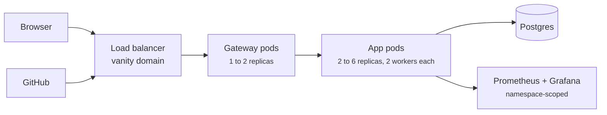

# Deploy

flowline deploys as a Kubernetes application rendered by the Jac runtime
itself. The supported path is jachammer, which runs that render for you on a
managed cluster with Postgres provisioned.
{ .fl-lede }

## What gets deployed

| Piece | Comes from |
| --- | --- |
| App pods | `[project]` in `jac.toml`, sized by `[scale.kubernetes]`, `[serve.workers]` processes each, serving the client bundle and the walker API |
| Gateway pods | `[scale.gateway]`, proxying requests to the app with a 120 second forward timeout |
| Postgres | Provisioned by the platform; both the graph and the docs store live there |
| Monitoring | `[scale.monitoring]`: `/metrics`, walker metrics, a Prometheus and Grafana pair |
| Secrets | The project's environment variables, applied as a Kubernetes Secret |

The platform hands every deploy to the Jac release pinned in `jac.toml`
(`{{ jac_version }}`), which renders the manifests and builds the client
bundle. What runs in production is decided by that pin, not by the `jac` on
your machine.

## Choose a path

-   :material-hammer-wrench:{ .lg .middle } **[Deploy with jachammer](jachammer.md)**

    ---

    `jachammer deploy` from the repo: preview URLs, production with a vanity
    domain, environment variables, rollbacks and CI tokens.

-   :material-kubernetes:{ .lg .middle } **Your own cluster**

    ---

    `jac scale deploy main.jac` targets the current Kubernetes context. Render
    and review the manifests first with
    `jac scale deploy --dry-run --show-yaml main.jac`.

## Environments

| Environment | URL | jachammer project |
| --- | --- | --- |
| Production | <https://flowline.jachammer.app> | `Flowline`, production slot |
| Development | <https://flowline-dev.jachammer.app> | `Dev Flowline`, production slot |

The CLI deploys whatever is checked out, so deploy each environment from its
branch: `dev` for development, `main` for production.

## Before every production deploy

- [ ] CI is green on the commit: format, lint, type check, and the serve job
      (deploy dry run, API, webhook and browser gates)
- [ ] `jac.toml` still declares the app under `[project]` with
      `entry-point = "main"`, and has no `[apps.*]` table
- [ ] The project's environment has every variable in
      [Production configuration](production.md#environment), including
      `GITHUB_APP_WEBHOOK_SECRET`
- [ ] The SSO callbacks and the GitHub App's URLs point at this deployment's
      `HOST`
- [ ] A Jac version bump was exercised on dev with real walker calls first
      ([Operations](operations.md#upgrading-jac-on-a-live-deployment))
