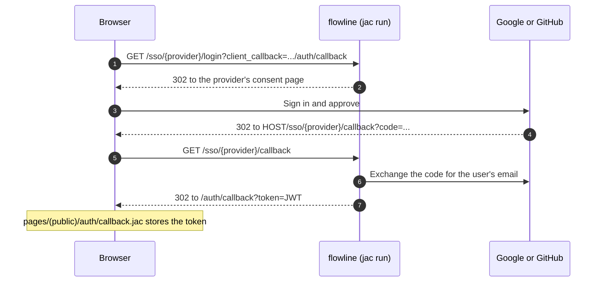

# Single sign-on

Email and password sign-up works with no setup. Google and GitHub
sign-in each need an OAuth client from that provider, and the Jac runtime does
the rest.
{ .fl-lede }

## How the round trip works



An existing account with the same email gets the SSO identity linked to it; a
new email creates an account. Either way the browser ends on `/auth/callback`
with a JWT, exactly like a password login.

## Register the OAuth clients

The redirect URL each provider must allow is the runtime's callback endpoint on
your public origin:

```text
<HOST>/sso/google/callback
<HOST>/sso/github/callback
```

`HOST` includes the scheme, for example `http://localhost:8000` locally or
`https://flowline.example.com` in production. Register one client per origin,
or add every origin you use to the same client.

=== "Google"

    1. Open <https://console.cloud.google.com/apis/credentials> and create an
       **OAuth client ID** of type **Web application**.
    2. Add `<HOST>/sso/google/callback` under **Authorized redirect URIs**.
    3. Copy the client id and secret into `.env`:

        ```bash
        GOOGLE_CLIENT_ID=...apps.googleusercontent.com
        GOOGLE_CLIENT_SECRET=...
        ```

=== "GitHub"

    1. Open <https://github.com/settings/developers> and create a **New OAuth
       App**.
    2. Set **Authorization callback URL** to `<HOST>/sso/github/callback`.
    3. Generate a client secret and copy both values into `.env`:

        ```bash
        GITHUB_CLIENT_ID=...
        GITHUB_CLIENT_SECRET=...
        ```

    This OAuth app only proves who someone is. It is **not** the GitHub App
    the integration uses: the runtime discards the sign-in token, so reading
    issues needs its own credential. See [Connect GitHub](github-app.md).

Restart the server after exporting the variables:

```bash
set -a; . ./.env; set +a
jac run --no-dev main.jac
```

## What the configuration looks like

```toml title="jac.toml"
[scale.sso]
host = "${HOST:-http://localhost:8000}"
client_auth_callback_url = "${HOST:-http://localhost:8000}/auth/callback"

[scale.sso.google]
client_id = "${GOOGLE_CLIENT_ID:-}"
client_secret = "${GOOGLE_CLIENT_SECRET:-}"

[scale.sso.github]
client_id = "${GITHUB_CLIENT_ID:-}"
client_secret = "${GITHUB_CLIENT_SECRET:-}"
```

## Notes and troubleshooting

- **Use production mode.** The hot-reload dev server does not proxy `/sso`, so
  test sign-in with `jac run --no-dev main.jac`.
- **The button says the provider is not configured.** The sign-in button
  probes the login endpoint first. A `501` (no client id and secret for that
  provider) or `422` becomes a friendly message instead of raw JSON in the
  address bar.
- **Why the client builds the login URL itself.** The runtime's initiate
  endpoint requires a `client_callback` query parameter, which the stock
  `jacSsoLogin` helper does not send, so `components/auth/SsoButtons.jac`
  builds `/sso/<provider>/login?client_callback=<origin>/auth/callback` by
  hand. The runtime honours that value only for a safe loopback address and
  otherwise uses `[scale.sso] client_auth_callback_url`.
- **`redirect_uri_mismatch` from the provider.** The registered callback does
  not match `<HOST>/sso/<provider>/callback` exactly: check the scheme, the
  port and a trailing slash, and that `HOST` was exported before the server
  started.
