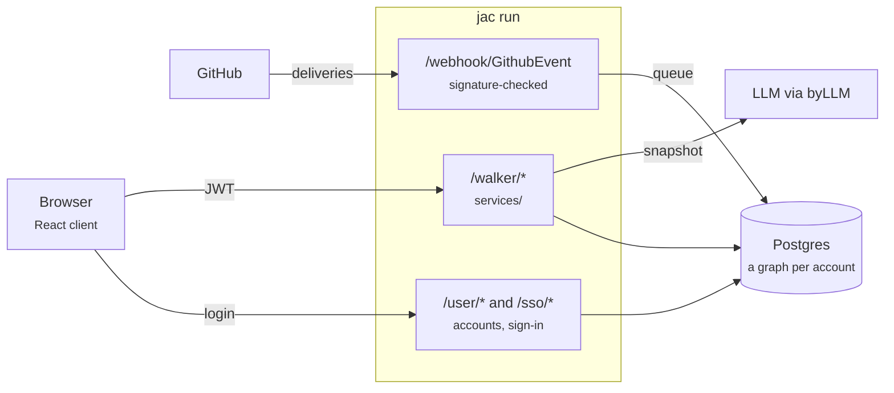

# flowline documentation

-   :material-rocket-launch-outline:{ .lg .middle } **Run it locally**

    ---

    Install the pinned Jac binary, pull dependencies and serve the app on
    `localhost:8000` in a few minutes.

    [:octicons-arrow-right-24: Get started](get-started/index.md)

-   :material-graph-outline:{ .lg .middle } **Understand the graph**

    ---

    Boxes, containers and typed edges: how a workspace is stored, and why one
    tenant can never reach another.

    [:octicons-arrow-right-24: Data graph](concepts/data-graph.md)

-   :material-api:{ .lg .middle } **Call the API**

    ---

    All {{ walker_count }} endpoints, with request fields generated straight
    from the walker source, report shapes and examples.

    [:octicons-arrow-right-24: API reference](api/index.md)

-   :material-cloud-upload-outline:{ .lg .middle } **Deploy with jachammer**

    ---

    Preview and production deploys, environment variables, domains, rollbacks
    and the sizing rules that keep the pods healthy.

    [:octicons-arrow-right-24: Deploy](deploy/jachammer.md)

## What flowline does

Most tools hand every team the same columns. In flowline a team draws the
steps it really uses, connects them however work moves (loops and branches
included), and **the board becomes those steps**. Every move the board makes
lands in a written daily log, so the standup note is already there. Work can
be planned into iterations and followed on a twelve-week roadmap.

{ .fl-demo loading=lazy }

-   :material-transit-connection-variant:{ .lg } **A flow line per organization**

    Start from Simple, the Software team template or a blank canvas. Each
    step carries a *kind* (start, active, handoff, blocked, done) behind the
    name you chose, so renaming a step never changes how anything behaves.

    [:octicons-arrow-right-24: Flow lines](concepts/flow-lines.md)

-   :material-notebook-edit-outline:{ .lg } **The board writes the log**

    Creating a task and every move land in the log with timestamps, issue and
    PR links and who was involved, and `/log` reads each day back as a
    written standup.

    [:octicons-arrow-right-24: The daily log](concepts/daily-log.md)

-   :material-github:{ .lg } **GitHub, live**

    Install a GitHub App on the repos you choose. Issues and pull requests
    reach an open board within seconds through signed webhooks.

    [:octicons-arrow-right-24: GitHub sync](concepts/github-sync.md)

-   :material-creation-outline:{ .lg } **An assistant that stays grounded**

    It reads a deterministic snapshot of the workspace, writes the standup
    note, answers questions, and proposes changes a person confirms.

    [:octicons-arrow-right-24: Assistant](api/assistant.md)

## How the pieces fit

flowline is one Jac project. The same `jac run` process serves the React client
and the walker API, and persists a graph per account in Postgres.

Walkers call GitHub with a short-lived installation token minted per request;
the webhook receiver only queues, and each workspace applies its own queue.

| You want to | Start here |
| --- | --- |
| Run the app on your machine | [Install Jac](get-started/install-jac.md), then [Run locally](get-started/run-locally.md) |
| Turn on Google or GitHub sign-in | [Single sign-on](get-started/sso.md) |
| Connect a GitHub App | [Connect GitHub](get-started/github-app.md) |
| Build against the API | [API overview](api/index.md) |
| Learn the stored graph | [Data graph](concepts/data-graph.md) |
| Ship a preview or production build | [Deploy with jachammer](deploy/jachammer.md) |
| Change the code | [Contributing](contributing/index.md) and [Jac gotchas](contributing/jac-gotchas.md) |
